# Agent Runtime Benchmark V4 Source-Audited 中文版

日期：2026-07-03

本文是对 V3 的纠偏版。V3 最大的问题不是图不够多，而是把“公开资料能确认的能力”“从产品形态推断的能力”“我们自己的目标边界”混在了一起。V4 改成证据优先：没有来源的格子只能写“未确认”，不能写“没有”。

调研方法门禁见：[source-audited-research-protocol.zh.md](./source-audited-research-protocol.zh.md)。

## 0. 本版先修正的错误

| 之前的错误说法 | V4 修正 |
| --- | --- |
| 把 workflow 和 worktree 混在一起 | worktree 是隔离 checkout；workflow 是任务流程/自动化。两者必须分开比较。 |
| 说某些能力“我们有，他们没有” | 改成“公开来源确认了什么 / 未确认什么 / 我们自己的边界是什么”。未找到证据不等于产品没有。 |
| 把插件、技能、MCP、hooks 当成少数产品特性 | 这些已经是多个成熟产品的通用能力面，比较重点不是“有没有”，而是治理、隔离、审批、可回放。 |
| 把 commit handoff 当成竞品通用术语 | commit handoff 是本项目术语：harness 在 task-scoped approval 后，从实际 diff-producing workspace 做 durable git commit。竞品可能有 PR、checkpoint、review、apply changes，但公开资料未必证明同一状态机。 |
| “无人值守只有这一项”表达不清 | 应改为 unattended/background/headless/automation 能力维度。Codex、Grok、Cursor、VS Code、Hermes、OpenClaw 等都有某种后台或自动化入口，不是单一项目独占。 |

## 1. 调研可信度规则

| 等级 | 意义 | 可以用来做什么 |
| --- | --- | --- |
| A | 官方文档、官方源码、官方产品页面直接确认 | 可以作为 PRD / issue 的引用依据。 |
| B | 官方索引、官方搜索片段、官方博客或相邻页面确认，但未抽到完整细节 | 可以作为方向依据，但 issue 里要继续补精确引用。 |
| C | GitHub issue、社区文章、第三方教程或产品使用经验 | 只能作为线索，不可作为安全边界依据。 |
| D | 未找到公开证据 | 只能写未知，不能写没有。 |

本文里的“确认”只表示公开资料确认该能力面存在，不表示它的内部实现等同于我们的 EventLog、Task Lease、Policy Gate、Approval State Machine 或 Commit Handoff。

## 2. 必须比较的能力维度

| 编号 | 维度 | 要看什么 |
| --- | --- | --- |
| D1 | 产品入口 | CLI、TUI、IDE、Web、移动端、聊天入口、API。 |
| D2 | 执行位置 | 本地、工作树、容器、云 VM、远程节点、headless、cron。 |
| D3 | worktree / workspace 隔离 | 是否隔离 checkout、是否 task-scoped、是否能并发。 |
| D4 | session / task 状态模型 | session、task、run、lease、queue、retry、terminal state。 |
| D5 | planning / build 分离 | plan mode、read-only planning、write blocking。 |
| D6 | tool runtime | 文件、shell、search、edit、browser、LSP、test、apply patch、custom tools。 |
| D7 | 权限 / 审批 / sandbox | allow/ask/deny、permission mode、hooks trust、OS sandbox、enterprise policy。 |
| D8 | 上下文 / 规则 | AGENTS.md、CLAUDE.md、rules、instructions、context files、repo map。 |
| D9 | skills / plugins / hooks / MCP | 可扩展能力、加载位置、信任边界、工具过滤。 |
| D10 | subagents / multi-agent | 内置或自定义子代理、并行任务、agent teams。 |
| D11 | memory / long-term state | 用户记忆、项目记忆、skill learning、session recall。 |
| D12 | VCS / diff / checkpoint / commit / PR | 生成 diff、review、checkpoint、PR、commit 归谁管。 |
| D13 | background / unattended | headless、cloud agent、GitHub Action、scheduler、cron、automations。 |
| D14 | observability / replay | timeline、event stream、logs、record/replay、inspect/report。 |
| D15 | governance source of truth | 谁拥有最终状态：产品 session、IDE、gateway、Postgres EventLog、GitHub PR。 |

## 3. 总体能力矩阵

标记说明：

- `A 确认`：官方资料直接确认。
- `B 部分`：官方资料或官方索引确认方向，但细节待补。
- `D 未确认`：公开资料未确认，不能写成没有。
- `Own 已有`：本项目当前已实现或已有明确 ADR/PRD 约束。
- `Own 目标`：本项目目标能力，还没完全实现。

| 产品 | D1 入口 | D2 执行位置 | D3 worktree | D4 状态模型 | D5 Plan/Build | D6 工具 | D7 权限 | D8 上下文 | D9 扩展 | D10 子代理 | D11 记忆 | D12 diff/commit/PR | D13 后台 | D14 可观察 | D15 事实源 |
| --- | --- | --- | --- | --- | --- | --- | --- | --- | --- | --- | --- | --- | --- | --- | --- |
| OpenCode | A 确认 | A 本地/CLI/TUI/Web/IDE | D 未确认 task worktree | B session/child sessions | A Build/Plan | A file/bash/LSP/MCP/custom tools | A permissions/policies | A rules/config | A MCP/LSP/skills/plugins | A subagents | B compaction/summary | D 未确认 harness-style commit handoff | B CLI/server/GitHub | B session/logs | OpenCode runtime |
| Claude Code | A CLI/Web/SDK | A 本地/后台/agent teams | A worktrees 页面 | B session/subagent/fork | A Plan/Explore | A built-in/MCP/tools | A permissions/hooks | A CLAUDE.md/settings | A MCP/skills/plugins/hooks | A built-in/custom | A memory | B VCS/PR/review，非同义 handoff | A noninteractive/background/schedule | B artifacts/hooks/logs | Claude session/runtime |
| OpenAI Codex | A CLI/IDE/Web/App/GitHub | A 本地/云/非交互 | A Worktrees | B task/session/cloud | B workflows/subagents | A shell/MCP/apply patch/computer use | A permissions/sandboxing/hooks | A AGENTS.md/rules/config | A MCP/plugins/skills/hooks | A subagents | A memories | A GitHub/PR/worktrees，非同义 handoff | A noninteractive/GitHub Action/cloud | A record/replay/inspect 类页面 | Codex local/cloud state |
| VS Code / Copilot Agents | A IDE/Agents Window/Chat | A local/CLI/cloud/third-party | D 未确认专属 worktree | B sessions/handoff | A Plan agent | A editor/terminal/browser/MCP/tools | A permission/sandbox/enterprise | A instructions/rules/prompt files | A skills/MCP/hooks/plugins | A subagents | A memory | A review edits/checkpoints，非同义 handoff | A cloud agents/remote sessions | A session insights/checkpoints | VS Code/Copilot session |
| Grok Build | A TUI/headless/ACP/API | A 本地/headless/API | D 未确认 | B session/inspect | B modes | A tools/MCP/LSP/hooks/plugins | B permission/trust/enterprise | A AGENTS/Claude compatibility | A skills/plugins/hooks/MCP/LSP/marketplaces | A subagents | D 未确认长期 memory | D 未确认 harness-style handoff | A headless/scripting | B inspect/JSON | Grok runtime |
| Cursor | A IDE/CLI/Cloud | A 本地/云 agent | B cloud env/workspace，worktree 细节未抽取 | B agent/run/API | B agent mode | A terminal/edit/MCP/browser 类能力 | B approvals/policy/hooks | A rules/AGENTS.md | A MCP/skills/hooks/subagents | A subagents | B rules/memory-like context | A review changes/cloud PR，非同义 handoff | A cloud agents/automations/API | B timeline/checkpoints | Cursor IDE/Cloud |
| OpenClaw | A Gateway/CLI/Web/admin/nodes | A daemon/nodes/headless | B agent workspace | A gateway/session/queue/events | B agent loop | A browser/sandbox/node/MCP | A pairing/policy/approvals | A SOUL/AGENTS/templates/context | A MCP/ACP/plugins/skills/bundles | A multi-agent lanes | A memory engines | B Codex harness docs，细节需审 | A gateway/cron/queues | A WS events/logs/status | OpenClaw Gateway |
| Hermes Agent | A CLI/Desktop/messaging | A local/Docker/SSH/Daytona/Modal | D 未确认 coding worktree | B session/runtime | B agent loop | A 60+ tools/tool gateway/MCP | A dangerous command/write approval/sandbox | A SOUL/context files | A skills/plugins/MCP | A delegates/parallel | A bounded memory/skills learning | D 未确认 harness-style handoff | A cron/messaging/remote backends | B session search/export | Hermes runtime/memory |
| coding-agent-harness 当前 | Own CLI/Rust crates | Own local/runtime + Codex lane fixture | Own Task Worktree/目标 | Own Postgres task_queue/Task Lease/EventLog | Own/目标 planning mode | Own Policy Gate + Tool Runtime，工具面待扩 | Own approval state machine | Own bounded context compiler | Own 目标 MCP/skills/hooks | Own 目标 subagents | Own 目标 governed memory | Own Commit Handoff | Own task queue/worker scheduling | Own inspect/report/replay | Own PostgreSQL EventLog |

结论：成熟产品多数都已经有工具、插件、技能、MCP、hooks、后台执行、子代理或类似能力。我们的差异不应该写成“他们没有这些功能”，而应该写成：

1. 我们要把这些能力收进一个私有 runtime。
2. runtime 的事实源是 PostgreSQL EventLog，而不是 UI session、外部 CLI session 或云端任务状态。
3. 所有可变更动作必须穿过 Policy Gate、Approval State Machine、Task Lease 和 Commit Handoff。

## 4. 争议概念统一口径

### 4.1 worktree 不是 workflow

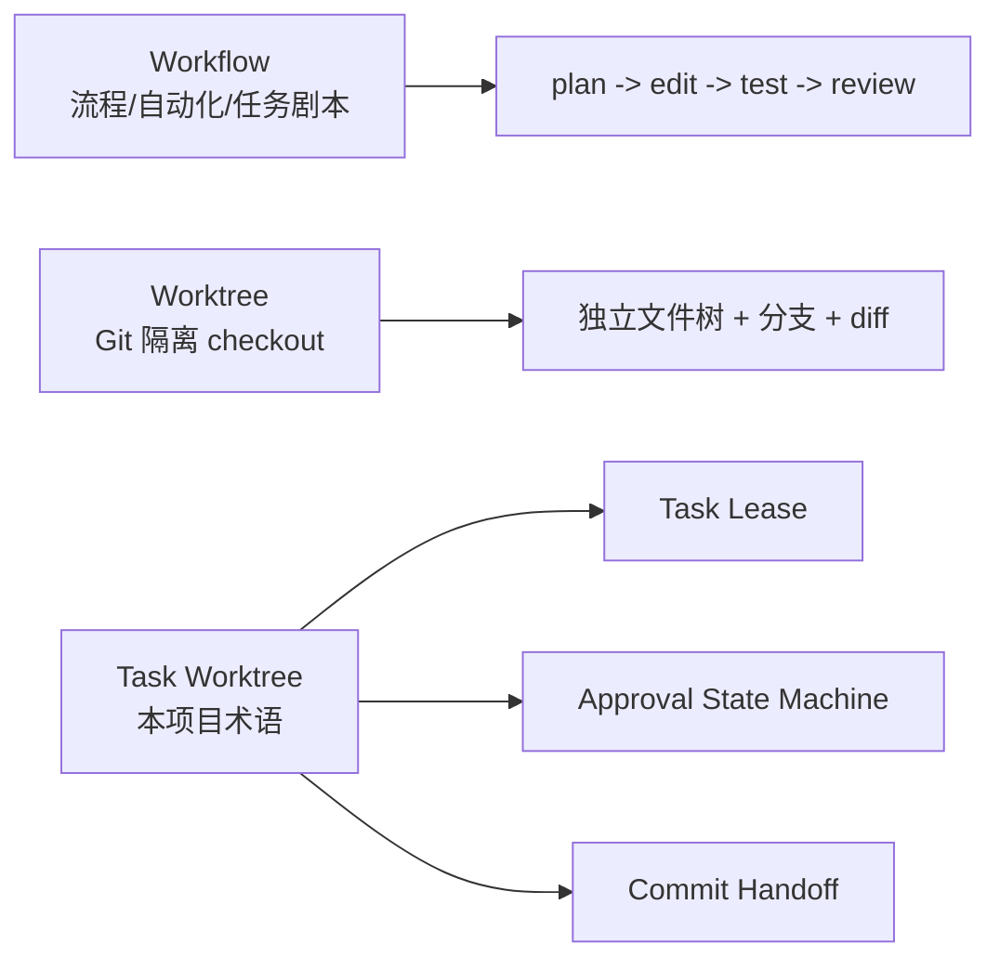

对比时应问：

- 是否有 worktree？
- worktree 是否 task-scoped？
- worktree diff 是否绑定 approval？
- commit/PR 是否由 runtime 拥有，还是由外部 agent / UI 拥有？

### 4.2 commit handoff 是我们自己的边界术语

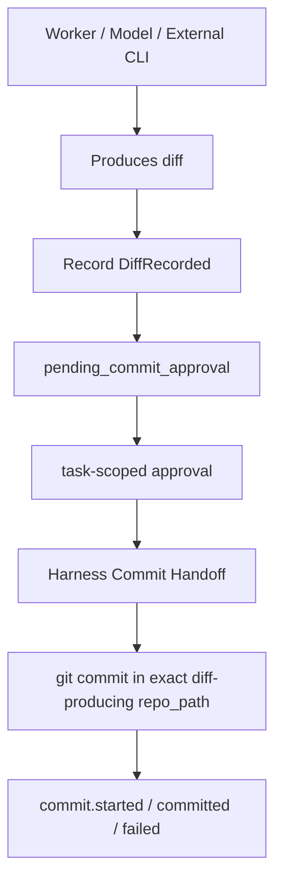

成熟产品可能有 PR、checkpoint、apply changes、review edits、cloud branch、undo 等，但这不自动等于本项目的 Commit Handoff。除非公开资料证明它们也有“task-scoped approval + exact diff workspace + runtime-owned durable commit + replayable event evidence”这一整套边界，否则只能写“相似 UX / 相似产物”，不能写“同构”。

### 4.3 无人值守 / background / headless 不是单一能力

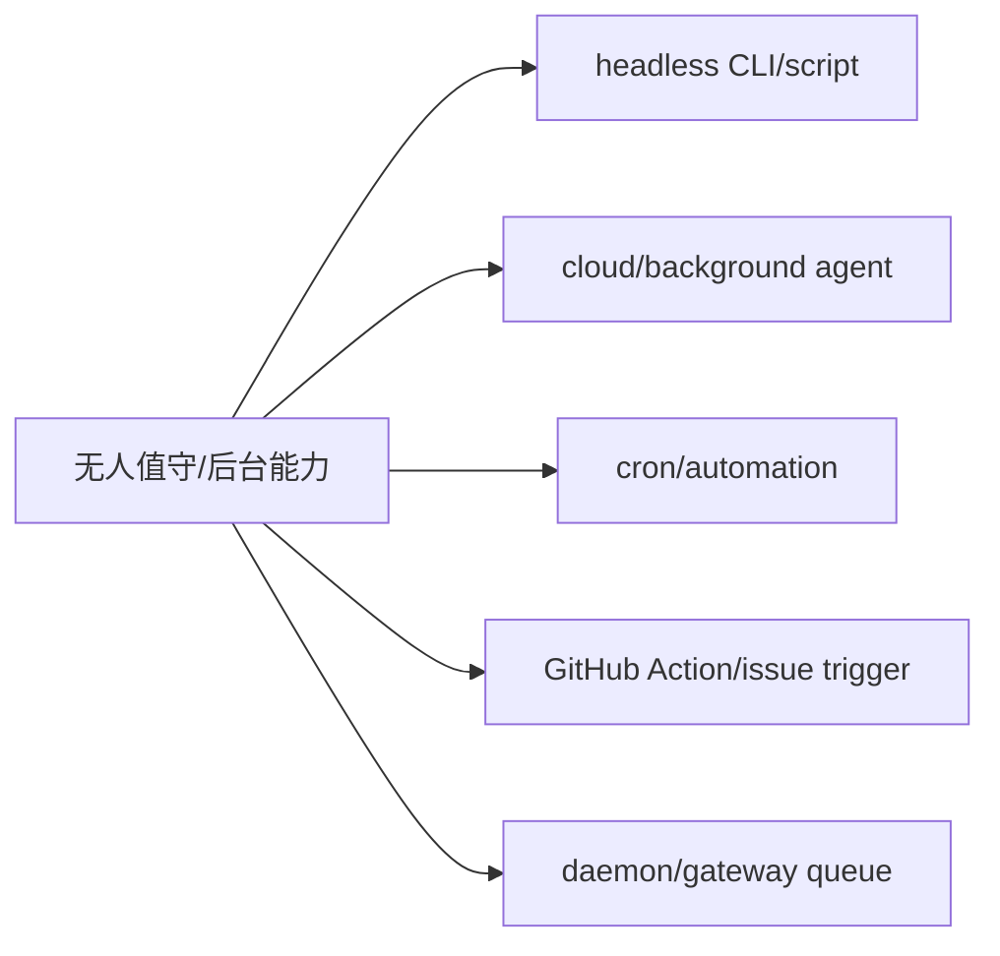

这类能力很多产品都有。我们要做的是让无人值守任务仍然不能绕过 Task Lease、Policy Gate、Approval、Commit Handoff、EventLog。

## 5. OpenCode

### 5.1 资料来源

| 来源 | 证据等级 | 确认内容 |
| --- | --- | --- |
| https://opencode.ai/docs/agents/ | A | Build/Plan primary agents，General/Explore/Scout subagents，agent permissions，Markdown/JSON agent config。 |
| https://opencode.ai/docs/permissions/ | A | 权限模型。 |
| https://opencode.ai/docs/mcp-servers/ | A | local/remote MCP，OAuth，per-agent MCP 管理。 |
| https://opencode.ai/docs/lsp/ | A | LSP servers。 |
| https://opencode.ai/docs/skills/ | A | Agent Skills。 |
| https://opencode.ai/docs/custom-tools/ | A | Custom Tools。 |
| https://opencode.ai/docs/plugins/ | A | Plugins。 |

### 5.2 能力面图

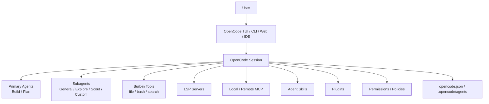

### 5.3 架构图

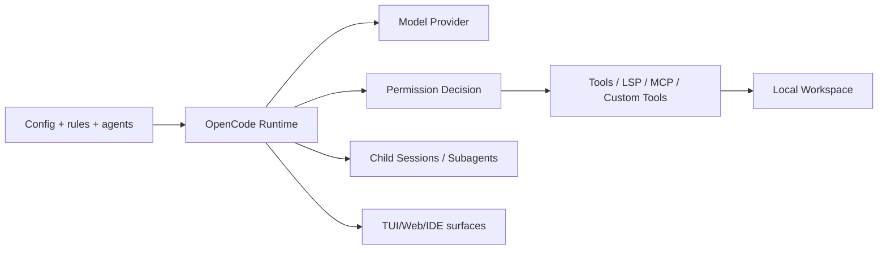

### 5.4 执行流程图

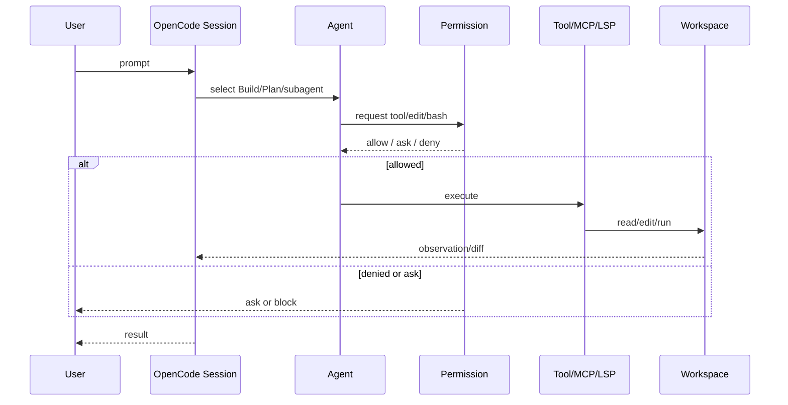

### 5.5 对基座的可借鉴点

| 可借鉴 | 原因 | 我们的边界 |
| --- | --- | --- |
| Build/Plan 分离 | 明确区分可写和只读计划。 | Planning mode 必须写入 EventLog，且 write blocking 由 Policy Gate 执行。 |
| Subagent ergonomics | 研究、探索、复杂任务可隔离上下文。 | 子代理不能直接写事实源，必须产生 evidence。 |
| MCP/LSP/Skills/Plugins | 扩展面完整。 | 所有扩展必须经过 capability declaration、policy、audit。 |

### 5.6 不可直接照搬

OpenCode runtime 可以作为开发交互层参考，但不能成为本项目 source of truth。我们需要的是 harness-owned session/task/lease/event/approval/commit 状态，而不是把 OpenCode session 当数据库。

## 6. Claude Code

### 6.1 资料来源

| 来源 | 证据等级 | 确认内容 |
| --- | --- | --- |
| https://docs.anthropic.com/en/docs/claude-code/sub-agents | A | built-in/custom subagents，tool restrictions，permission modes，foreground/background，nested agents。 |
| https://docs.anthropic.com/en/docs/claude-code/hooks | A | lifecycle hooks。 |
| https://docs.anthropic.com/en/docs/claude-code/memory | A | project/user memory。 |
| https://docs.anthropic.com/en/docs/claude-code/mcp | A | MCP integration。 |
| https://code.claude.com/docs/en/sub-agents | A | 新版 Claude Code docs，包含 built-in agents、worktrees、agent teams、plugins、skills 索引。 |

### 6.2 能力面图

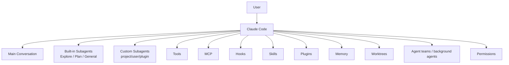

### 6.3 架构图

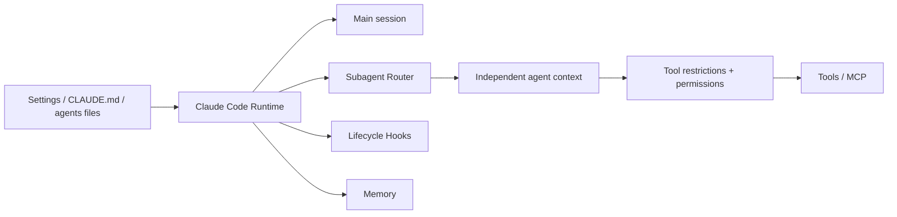

### 6.4 执行流程图

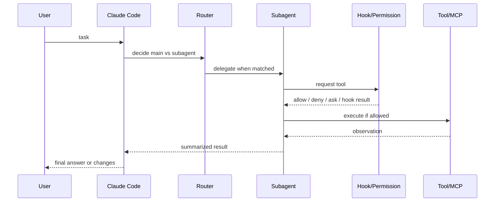

### 6.5 对基座的可借鉴点

| 可借鉴 | 原因 | 我们的边界 |
| --- | --- | --- |
| Subagent scope + permissions | 子代理不仅是多线程，还能限制工具、模型、上下文。 | 我们的 subagent 必须是 task/evidence participant，不是事实源。 |
| Hooks | 生命周期拦截点成熟。 | Phase B 只先做少量高价值 hooks，不能复制全生命周期导致安全面膨胀。 |
| Memory / Skills / Plugins | 能力复用和长期上下文完整。 | 记忆和技能必须 candidate -> review -> activate。 |
| Worktrees | 官方已存在相关能力。 | 我们不能说 worktree 是我们特有；我们的差异是 Task Worktree 与 lease/approval/commit 绑定。 |

### 6.6 不可直接照搬

Claude Code 的权限和 session 语义服务于 Claude 产品。本项目不能把 Claude session、Claude memory 或 Claude hook event 当成 durable runtime truth。

## 7. OpenAI Codex

### 7.1 资料来源

| 来源 | 证据等级 | 确认内容 |
| --- | --- | --- |
| https://developers.openai.com/codex | A | Codex 产品索引，包含 app、IDE、CLI、Web、GitHub、worktrees、permissions、hooks、MCP、plugins、skills、subagents、non-interactive、GitHub Action。 |
| https://developers.openai.com/codex/app/worktrees | A | Worktrees。 |
| https://developers.openai.com/codex/permissions | A | Permissions。 |
| https://developers.openai.com/codex/hooks | A | Hooks。 |
| https://developers.openai.com/codex/mcp | A | MCP。 |
| https://developers.openai.com/codex/plugins | A | Plugins。 |
| https://developers.openai.com/codex/skills | A | Agent Skills / Record & Replay。 |
| https://developers.openai.com/codex/noninteractive | A | Non-interactive mode。 |
| https://developers.openai.com/codex/github-action | A | GitHub Action。 |
| https://developers.openai.com/codex/guides/agents-md | A | AGENTS.md。 |
| https://github.com/openai/codex | A | Codex CLI source and README。 |

### 7.2 能力面图

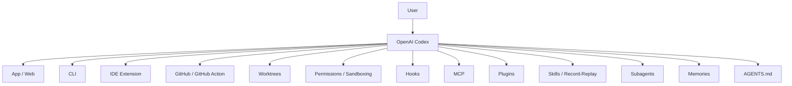

### 7.3 架构图

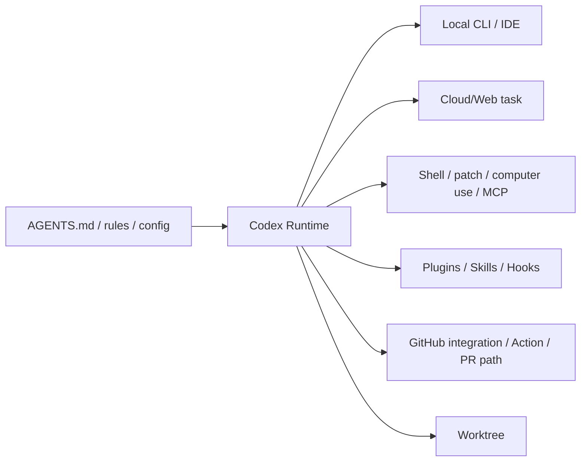

### 7.4 执行流程图

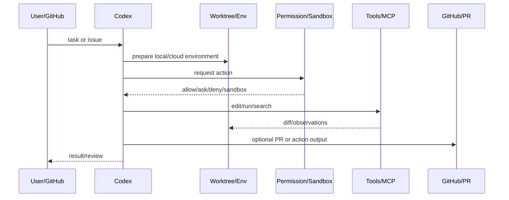

### 7.5 对基座的可借鉴点

| 可借鉴 | 原因 | 我们的边界 |
| --- | --- | --- |
| AGENTS.md | 已是跨工具事实标准之一。 | 作为 context compiler 输入，不作为唯一策略源。 |
| Worktrees / cloud / non-interactive / GitHub Action | 覆盖本地、云端、自动化。 | 外部 Codex lane 是 evidence-producing worker，不是 source of truth。 |
| Skills / plugins / MCP / hooks / record-replay | 扩展和可复用能力面成熟。 | 我们要先设计 capability registry + policy + EventLog。 |

### 7.6 不可直接照搬

不能再说 Codex 没有 worktree、skills、plugins、hooks、MCP、subagents 或 record/replay。正确差异是：Codex 产品内部状态不等于本项目的 PostgreSQL EventLog，也不证明它的 PR/commit 流程等同于我们的 Commit Handoff 状态机。

## 8. VS Code / GitHub Copilot Agents

### 8.1 资料来源

| 来源 | 证据等级 | 确认内容 |
| --- | --- | --- |
| https://code.visualstudio.com/docs/agents/overview | A | Agents Window / Chat View，local agents、Copilot CLI、cloud agents、third-party agents、session handoff、permissions、sandbox、instructions、skills、MCP、hooks、plugins。 |
| https://code.visualstudio.com/docs/agent-customization/overview | A | Instructions、skills、custom agents、prompt files。 |
| https://code.visualstudio.com/docs/agent-customization/mcp-servers | A | MCP servers。 |
| https://code.visualstudio.com/docs/agents/overview#_trust-and-control | A | approve/deny、permission level、sandbox、enterprise policy。 |

### 8.2 能力面图

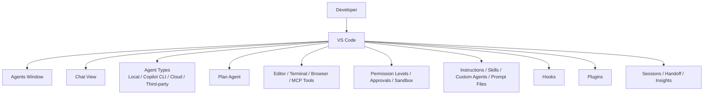

### 8.3 架构图

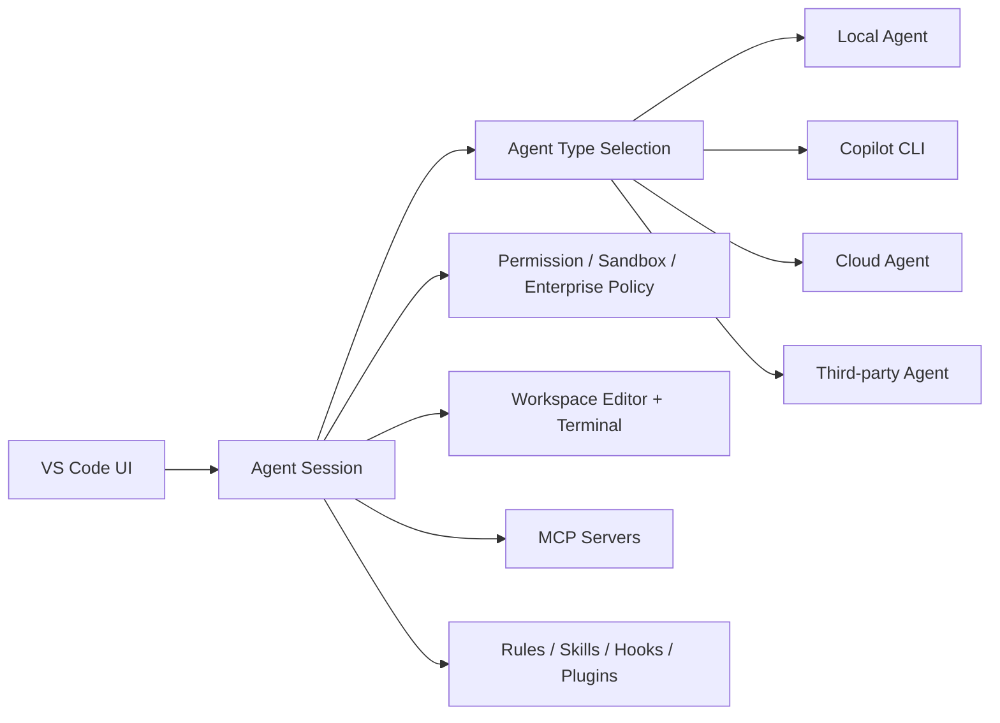

### 8.4 执行流程图

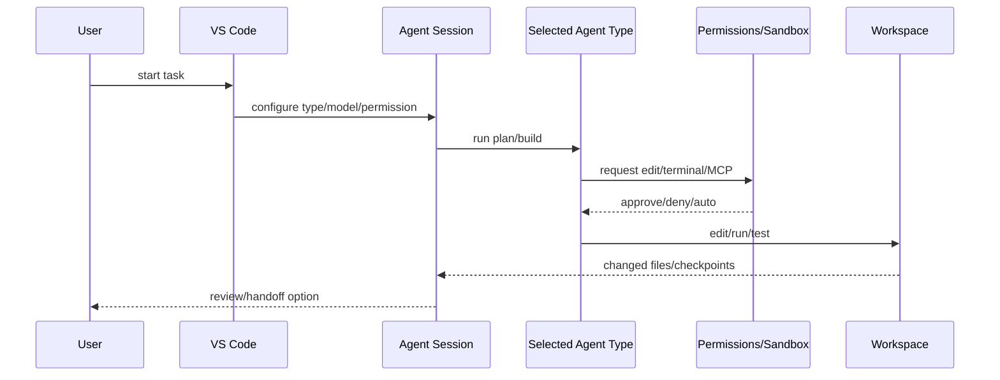

### 8.5 对基座的可借鉴点

| 可借鉴 | 原因 | 我们的边界 |
| --- | --- | --- |
| Agent type taxonomy | 本地、CLI、云、第三方清晰分层。 | 我们用 worker lane contract 对齐，不让 client 类型改事实源。 |
| Session handoff | 用户体验上很重要。 | handoff 必须落到 EventLog/Task 状态，而不是 UI-only。 |
| Plan agent + approvals | 先计划再写入，适合 Phase A。 | Write blocking 由 Policy Gate 保证。 |
| Inspect/session insights | 可观察性方向明确。 | Phase C 前先做 CLI/API inspect/report。 |

### 8.6 不可直接照搬

VS Code 是产品面/IDE 面很强的系统。我们不能先做 UI，否则会用 UI 状态替代 runtime 状态。正确顺序是先把 runtime inspect/report 做实，再接 TUI/Web/IDE/iOS。

## 9. Grok Build

### 9.1 资料来源

| 来源 | 证据等级 | 确认内容 |
| --- | --- | --- |
| https://docs.x.ai/build/overview | A | TUI、headless scripting、ACP、custom models、`grok inspect`。 |
| https://docs.x.ai/build/modes-and-commands | A | Modes and commands。 |
| https://docs.x.ai/build/features/skills-plugins-marketplaces | A | Skills、plugins、hooks、marketplaces、subagents、Claude Code compatibility、AGENTS.md compatibility。 |
| https://docs.x.ai/build/cli/headless-scripting | A | Headless scripting。 |
| https://docs.x.ai/build/enterprise | A | Enterprise deployments。 |
| https://docs.x.ai/developers/tools/remote-mcp | A | Remote MCP tools。 |

### 9.2 能力面图

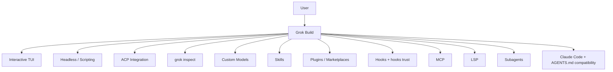

### 9.3 架构图

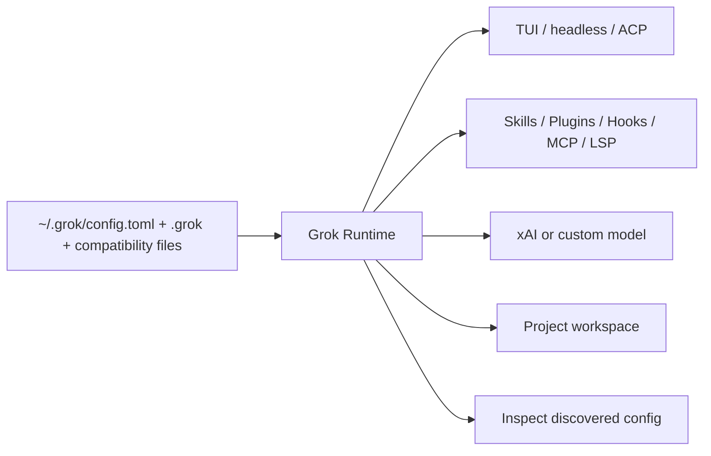

### 9.4 执行流程图

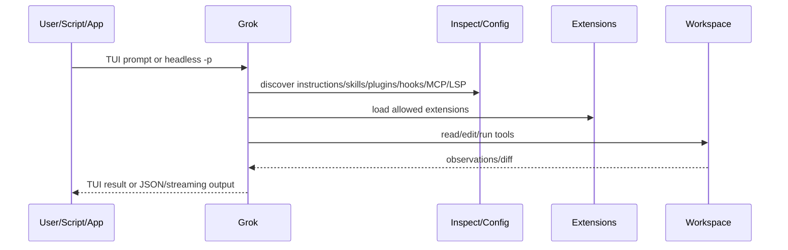

### 9.5 对基座的可借鉴点

| 可借鉴 | 原因 | 我们的边界 |
| --- | --- | --- |
| `inspect` | 用户能看到系统发现了什么配置和扩展。 | 我们 v0.4 inspect/report 应该显示 session/task/lease/EventLog/approval/commit。 |
| Headless + ACP | 适合作为 worker lane / external adapter 思路。 | worker lane 只能产 evidence，不能绕过 policy。 |
| Compatibility import | 直接读取 Claude / AGENTS 生态，迁移成本低。 | 兼容导入必须经过 trust and policy，不可直接执行 hooks/plugins。 |

### 9.6 不可直接照搬

Grok 的扩展发现很强，但对我们而言，发现不等于授权。每个 plugin、hook、skill、MCP server 都要声明 capability，再由 Policy Gate 和 EventLog 管住。

## 10. Cursor

### 10.1 资料来源

| 来源 | 证据等级 | 确认内容 |
| --- | --- | --- |
| https://cursor.com/docs/agent/overview | B | 官方搜索片段确认 autonomous coding、terminal commands、code editing。页面正文抓取为空，issue 化前需再次精确抽取。 |
| https://cursor.com/docs/cloud-agent | B | 官方搜索片段确认 Cloud Agents。 |
| https://cursor.com/docs/rules | B | 官方搜索片段确认 Rules、AGENTS.md。 |
| https://cursor.com/docs/mcp | B | 官方搜索片段确认 MCP。 |
| https://cursor.com/docs/hooks | B | 官方搜索片段确认 Hooks。 |
| https://cursor.com/docs/skills | B | 官方搜索片段确认 Agent Skills。 |
| https://cursor.com/docs/subagents | B | 官方搜索片段确认 Subagents。 |
| https://cursor.com/docs/cli/using | B | 官方搜索片段确认 CLI agent、MCP、rules、review changes。 |
| https://cursor.com/docs/cloud-agent/api/endpoints | B | 官方搜索片段确认 Cloud Agents API。 |
| https://cursor.com/blog/agent-computer-use | B | 官方博客可作为 browser/computer-use 线索。 |

### 10.2 能力面图

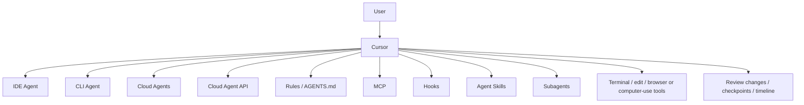

### 10.3 架构图

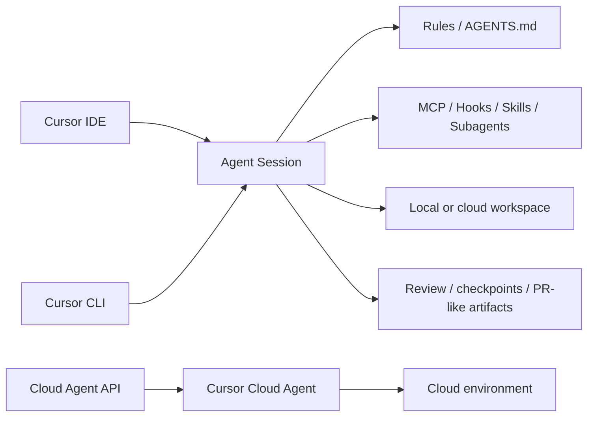

### 10.4 执行流程图

```mermaid
sequenceDiagram
    participant U as User/API
    participant C as Cursor
    participant E as Env
    participant X as Extensions
    participant R as Review
    U->>C: local/CLI/cloud task
    C->>E: create or use workspace
    C->>X: apply rules/MCP/hooks/skills
    C->>E: edit/run/review changes
    E-->>C: diff/checkpoint/output
    C->>R: present review/timeline/PR-like result
    R-->>U: accept/continue
```

### 10.5 对基座的可借鉴点

| 可借鉴 | 原因 | 我们的边界 |
| --- | --- | --- |
| Cloud Agent UX | 后台长任务和 review 体验成熟。 | Phase C 之前只做 API/inspect，不先做云 VM 产品化。 |
| Rules + AGENTS.md | 用户规则体系成熟。 | 规则进入 context compiler，不直接变成 policy。 |
| Timeline/checkpoint | 可视化回看强。 | 不能替代 EventLog replay。 |

### 10.6 不可直接照搬

Cursor 是 IDE-first/product-first。我们的目标不是复制一个编辑器，而是做私有 runtime；所以不能把 checkpoint、timeline 或 cloud run 状态当成 EventLog。

## 11. OpenClaw

### 11.1 资料来源

| 来源 | 证据等级 | 确认内容 |
| --- | --- | --- |
| https://docs.openclaw.ai/concepts/architecture | A | Gateway daemon、WS API、clients、nodes、pairing、auth、events、idempotency、remote access、schema/codegen。 |
| https://docs.openclaw.ai/cli/mcp | A | CLI index 确认 MCP、ACP、approvals、browser、cron、nodes、sandbox、plugins、skills、workboard、Codex harness docs、queues、memory、多代理等入口。 |
| https://docs.openclaw.ai/concepts/architecture#wire-protocol-summary | A | WebSocket request/response/event protocol。 |
| https://docs.openclaw.ai/concepts/architecture#pairing-local-trust | A | Pairing and local trust model。 |

### 11.2 能力面图

```mermaid
flowchart TD
    Operator["Operator"] --> Gateway["OpenClaw Gateway"]
    Client["CLI / mac app / web admin"] --> Gateway
    Channels["WhatsApp / Telegram / Slack / Discord / etc"] --> Gateway
    Nodes["macOS / iOS / Android / headless nodes"] --> Gateway
    Gateway --> WS["Typed WebSocket API"]
    Gateway --> Events["Events / presence / health / heartbeat / cron"]
    Gateway --> Pairing["Device pairing / auth / signed challenge"]
    Gateway --> Queue["Command / steering queue"]
    Gateway --> MCP["MCP"]
    Gateway --> ACP["ACP"]
    Gateway --> Plugins["Plugins / skills / bundles"]
    Gateway --> Memory["Memory engines"]
    Gateway --> Sandbox["Sandbox / approvals"]
```

### 11.3 架构图

```mermaid
flowchart LR
    Gateway["Long-lived Gateway"] --> Providers["Messaging providers"]
    Gateway --> Clients["Control clients"]
    Gateway --> Nodes["Capability nodes"]
    Gateway --> Protocol["JSON Schema WS protocol"]
    Protocol --> Codegen["Swift / typed models"]
    Gateway --> Auth["Auth + pairing + idempotency"]
    Gateway --> Agent["Agent runtime / loop"]
    Agent --> Tools["MCP / ACP / sandbox / browser / node commands"]
```

### 11.4 执行流程图

```mermaid
sequenceDiagram
    participant C as Client/Channel
    participant G as Gateway
    participant N as Node/Tool
    participant A as Agent Runtime
    C->>G: connect with identity/auth
    G-->>C: hello-ok snapshot
    C->>G: req:agent or message
    G->>A: accept run / emit event
    A->>N: execute capability
    N-->>A: result
    A-->>G: streaming/final events
    G-->>C: event:agent / final status
```

### 11.5 对基座的可借鉴点

| 可借鉴 | 原因 | 我们的边界 |
| --- | --- | --- |
| Gateway/control plane | 很接近我们 Phase C 的 daemon/API/control surface。 | Gateway 不能绕过 Postgres EventLog。 |
| Typed WS protocol + schema | 适合多客户端：CLI/TUI/Web/iOS/IDE。 | 协议事件要映射到 runtime state，不是 UI-only push。 |
| Node capability declaration | 适合插件、设备、远程 worker。 | 节点声明能力不等于获准执行。 |
| Pairing/auth/idempotency | 对远程控制面关键。 | Phase C 之前先把 inspect/report API 固定。 |

### 11.6 不可直接照搬

OpenClaw 的 Gateway 范围比 coding runtime 更广，包含消息平台、设备节点、canvas、移动端等。我们不能一次吃下全部，应该先借它的 control-plane 拓扑：Gateway、typed protocol、capability declaration、pairing、events。

## 12. Hermes Agent

### 12.1 资料来源

| 来源 | 证据等级 | 确认内容 |
| --- | --- | --- |
| https://hermes-agent.nousresearch.com/docs/ | A | 长期运行 agent、学习循环、60+ tools、20+ messaging platforms、terminal backends、cron、delegates、MCP、skills、memory。 |
| https://hermes-agent.nousresearch.com/docs/user-guide/features/memory | A | bounded curated memory，MEMORY.md / USER.md，字符预算，session start 注入。 |
| https://hermes-agent.nousresearch.com/docs/user-guide/features/skills | A | Skills system。 |
| https://hermes-agent.nousresearch.com/docs/user-guide/features/mcp | A | stdio/HTTP MCP，OAuth，tool filtering，catalog trust model。 |
| https://hermes-agent.nousresearch.com/docs/user-guide/security | A | command approval、authorization、container isolation。 |
| https://hermes-agent.nousresearch.com/docs/developer-guide/architecture | A | Architecture。 |

### 12.2 能力面图

```mermaid
flowchart TD
    User["User"] --> Hermes["Hermes Agent"]
    Hermes --> CLI["CLI / Desktop"]
    Hermes --> Messaging["Messaging Gateway\nTelegram / Discord / Slack / etc"]
    Hermes --> Backends["Terminal Backends\nlocal / Docker / SSH / Daytona / Singularity / Modal"]
    Hermes --> Tools["60+ Tools / Tool Gateway"]
    Hermes --> MCP["MCP stdio/HTTP + filtering"]
    Hermes --> Memory["Bounded Memory\nMEMORY.md / USER.md"]
    Hermes --> Skills["Skills / self-improvement"]
    Hermes --> Cron["Cron / automations"]
    Hermes --> Delegates["Delegates / parallel work"]
    Hermes --> Security["Dangerous command approval / sandbox / write approval"]
```

### 12.3 架构图

```mermaid
flowchart LR
    Interfaces["CLI/Desktop/Messaging"] --> Runtime["Hermes Runtime"]
    Runtime --> Model["Model provider"]
    Runtime --> Terminal["Terminal backend"]
    Runtime --> ToolGateway["Tool Gateway"]
    ToolGateway --> Builtins["Built-in tools"]
    ToolGateway --> MCP["MCP servers"]
    Runtime --> Memory["Curated bounded memory"]
    Runtime --> Skills["Skills system"]
    Runtime --> Security["Approval / sandbox"]
    Runtime --> Cron["Cron scheduler"]
```

### 12.4 执行流程图

```mermaid
sequenceDiagram
    participant U as User/Message
    participant H as Hermes
    participant M as Memory/Skills
    participant S as Security
    participant T as Tool/Terminal/MCP
    U->>H: task
    H->>M: load bounded memory/skills
    H->>S: check dangerous command/write
    S-->>H: approve/deny/ask
    H->>T: execute through backend/tool gateway
    T-->>H: result
    H->>M: propose or update memory/skill
    H-->>U: answer/progress
```

### 12.5 对基座的可借鉴点

| 可借鉴 | 原因 | 我们的边界 |
| --- | --- | --- |
| Bounded memory | 明确预算，避免无限膨胀。 | memory candidate 必须可 review，不自动写入影响未来任务。 |
| MCP filtering + trust model | 不只是能连 MCP，还能筛选工具。 | MCP capability 必须进入 Policy Gate。 |
| Terminal backends | local/Docker/SSH/cloud-like backend 适合远程执行。 | 每个 backend 都必须是 worker lane 或 tool runtime adapter。 |
| Messaging/cron | 长期个人 agent 的入口丰富。 | Phase C 以后接，不能早于 runtime inspect/report。 |

### 12.6 不可直接照搬

Hermes 是长期个人 agent，不是纯 coding runtime。它的记忆和技能很强，但如果直接照搬“自动学习”，会和我们的 audit/replay/safety 冲突。我们应学 bounded memory 和 reviewable skills，不学无审查自动持久化。

## 13. 当前 coding-agent-harness 基座

### 13.1 本项目当前能力面

```mermaid
flowchart TD
    CLI["harness CLI"] --> Runtime["Rust Runtime"]
    Runtime --> EventLog["PostgreSQL EventLog\nsource of truth"]
    Runtime --> Queue["task_queue + Task Lease"]
    Runtime --> Policy["Policy Gate"]
    Runtime --> Tools["Tool Runtime"]
    Runtime --> Context["Bounded Context Compiler"]
    Runtime --> Agent["Internal fake-model agent turn / recovery loop"]
    Runtime --> Lane["Governed Codex CLI worker lane contract"]
    Runtime --> Worktree["Task Worktree / repo_path"]
    Runtime --> Approval["Approval State Machine"]
    Runtime --> Commit["Commit Handoff"]
    Runtime --> Inspect["Inspect / report surface"]
    Tools --> EventLog
    Queue --> EventLog
    Approval --> EventLog
    Commit --> EventLog
```

### 13.2 当前架构图

```mermaid
flowchart LR
    User["User / CLI"] --> CLI["harness-cli"]
    CLI --> Runtime["harness-runtime"]
    Runtime --> DB["PostgreSQL\nsessions / events / task_queue / leases / approvals"]
    Runtime --> Policy["harness-policy"]
    Runtime --> ToolRuntime["harness-tools"]
    Runtime --> Context["harness-context"]
    Runtime --> Models["harness-models"]
    Runtime --> ExternalLane["external worker lane\nCodex CLI contract"]
    ExternalLane --> Worktree["Task Worktree"]
    ToolRuntime --> Repo["Repository"]
    Runtime --> Git["Commit Handoff"]
    Git --> Repo
```

### 13.3 当前执行流程图

```mermaid
sequenceDiagram
    participant U as User/CLI
    participant R as Harness Runtime
    participant DB as PostgreSQL EventLog/Queue
    participant P as Policy Gate
    participant T as Tool Runtime / Worker Lane
    participant G as Git
    U->>R: start task/session
    R->>DB: append session/task events
    R->>DB: enqueue task / acquire lease
    R->>P: authorize tool or lane action
    P-->>R: allow / deny / requires approval
    R->>T: execute if allowed
    T-->>R: observations/diff/validation
    R->>DB: record evidence
    R-->>U: pending_commit_approval
    U->>R: approve task-scoped diff
    R->>G: commit exact diff-producing repo_path
    G-->>R: commit sha or failure
    R->>DB: record commit outcome
```

### 13.4 我们真正已经领先或不同的地方

这不是“别人没有”，而是“我们把它作为一等 runtime 边界来做”：

| 能力 | 成熟产品也可能有类似项 | 我们的不同点 |
| --- | --- | --- |
| EventLog source of truth | 很多产品有 session logs、timeline、record/replay、events | 我们把 EventLog 当 runtime truth，不是 UI 展示副产物。 |
| PostgreSQL task_queue + Task Lease | OpenClaw 有 queue/gateway 概念，云产品有内部调度 | 我们把 lease ownership、deadline、heartbeat、terminal transition 作为公开可测边界。 |
| Policy Gate + Tool Runtime | 多数产品都有 permissions/approvals | 我们要求工具执行必须携带 policy decision，denied 也要记录 evidence。 |
| Approval State Machine | 多数产品有 approve/deny/review | 我们要求 task-scoped approval，approval 后 hard-deny 仍有效。 |
| Commit Handoff | 多数产品有 diff/PR/checkpoint/review | 我们要求 approved diff 从 exact diff-producing repo_path 提交，commit event 可回放。 |
| External worker lane | Codex/Claude/Grok/OpenCode 都能当 worker | 我们不让外部 lane 拥有 task truth，只让它产 evidence。 |

### 13.5 我们现在明显落后的地方

| 能力面 | 成熟产品状态 | 我们状态 |
| --- | --- | --- |
| 真实模型 agent loop | Claude/Codex/OpenCode/Grok/Cursor 都是核心能力 | 我们仍以 fake-model/internal fixture 为主，真实 provider routing 未闭环。 |
| 标准 coding tools | 成熟产品内置 read/edit/search/shell/browser/LSP/MCP | 我们 Tool Runtime 边界有，但工具面还窄。 |
| MCP/skills/plugins/hooks | 多数成熟产品已有 | 我们还在 Phase B 目标，不能提前扩张。 |
| Subagents / parallel work | Claude/OpenCode/Grok/Cursor/VS Code/Hermes/OpenClaw 都有类似能力 | 我们还没有稳定 subagent runtime。 |
| Memory | Claude/Codex/VS Code/Hermes/OpenClaw/Cursor 等有不同形式 | 我们还没有 governed memory。 |
| Product UI | VS Code/Cursor/Codex/OpenCode/Grok 很强 | 我们只有 CLI/inspect/report，Web/TUI/iOS 未做。 |
| Gateway/API/remote control | OpenClaw/Hermes/Cursor/Codex/VS Code 有强产品面 | 我们 Phase C 才做。 |

## 14. 目标私有 runtime 拓扑

```mermaid
flowchart TD
    Clients["Clients\nCLI / TUI / Web / IDE / iOS / chat"] --> API["Harness API / Gateway"]
    API --> Runtime["Harness Runtime Core"]
    Runtime --> EventLog["PostgreSQL EventLog\nsource of truth"]
    Runtime --> Queue["Task Queue + Task Lease"]
    Runtime --> Policy["Policy Gate"]
    Runtime --> Approval["Approval State Machine"]
    Runtime --> Context["Context Compiler"]
    Runtime --> ModelLoop["Internal Agent Loop"]
    Runtime --> ToolRuntime["Tool Runtime"]
    Runtime --> ExtensionRegistry["Governed Extensions\nMCP / skills / plugins / hooks"]
    Runtime --> WorkerLanes["Worker Lanes\nCodex / Claude / OpenCode / Grok / custom"]
    Runtime --> Memory["Governed Memory\ncandidate -> review -> activate"]
    Runtime --> Observability["Inspect / Report / Replay / Timeline"]
    ToolRuntime --> Workspaces["Task Worktrees / repos"]
    WorkerLanes --> Workspaces
    Workspaces --> Commit["Commit Handoff"]
    Commit --> EventLog
    ExtensionRegistry --> Policy
    Memory --> Context
    Observability --> EventLog
```

## 15. V4 后的路线判断

### 15.1 不能马上按 #75-#79 开工的原因

#75-#79 是 Phase A 候选，不是已批准实施队列。原因：

1. V3 对竞品能力判断证据不足。
2. Codex、Claude、Grok、Cursor、VS Code 等已经有 plugins/skills/hooks/MCP/subagents/headless/worktrees 等大量能力，不能按“别人没有”来设计。
3. #74 已经有明确 gate：每个外部能力必须引用 source-audited benchmark section/confidence level。
4. 如果 benchmark 不稳，issue 拆出来会把错误假设固化进工程计划。

### 15.2 现在应该重新确认的 Phase A

Phase A 仍然应该做 runtime core，但理由要改：

| 候选 issue | 旧理由 | V4 正确理由 |
| --- | --- | --- |
| #75 model provider routing | 让我们拥有模型能力 | 成熟产品都有真实模型 loop；我们缺真实 provider，但必须保留 harness-owned EventLog 和 policy。 |
| #76 bounded internal agent loop | 从 fake-model 走向真实 loop | 不是复制 Claude/Codex loop，而是做 bounded、evented、stoppable loop。 |
| #77 standard coding tools | 我们要有工具 | 大家都有工具；我们的目标是工具必须经 Policy Gate + Tool Runtime + EventLog。 |
| #78 planning mode | 类似 OpenCode/Claude/VS Code/Grok Plan | Plan 的关键不是名字，而是 read-only/write blocking 由 runtime 保证。 |
| #79 observable E2E task | 验收链路 | 必须证明 task -> lease -> context -> model/tool -> validation -> approval -> commit/report 可回放。 |

### 15.3 Phase B/C 应延后但要提前设计边界

| Phase | 可以从谁学 | 先不做什么 |
| --- | --- | --- |
| Phase B MCP/skills/hooks/plugins | OpenCode、Claude、Codex、Grok、Cursor、VS Code、Hermes、OpenClaw | 不做 broad mutating MCP；不自动激活技能/记忆；不让 hooks 执行任意命令。 |
| Phase B subagents/memory | Claude、OpenCode、Hermes、OpenClaw、Grok、Cursor、VS Code | 不让 subagent 独立提交；不让 memory 无审批持久化。 |
| Phase C API/Gateway/UI | OpenClaw、VS Code、Cursor、Codex、Hermes | 不先做复杂 Web UI；先做 inspect/report/API/streaming event contract。 |

## 16. 最终对齐结论

现在应当这样理解：

1. 我们不是在证明“别人没有而我们有”。
2. 我们是在把成熟产品已经验证过的能力面吸收进一个私有、可审计、可回放、可治理的 Rust runtime。
3. 成熟产品的共同能力越来越多：tools、permissions、MCP、skills、plugins、hooks、subagents、worktrees、background、cloud、memory、checkpoints 都在融合。
4. 我们的护城河不是功能名，而是边界：
   - EventLog 是事实源。
   - Task Lease 管 worker ownership。
   - Policy Gate 管每次工具/扩展/worker 行为。
   - Approval State Machine 管用户批准。
   - Commit Handoff 管 durable git history。
   - External lane 只能产 evidence，不能接管 runtime truth。
5. 因此下一步不是直接实现 #75-#79，而是先由 owner 用这份 V4 判断：
   - 产品能力理解是否认可；
   - #75-#79 是否仍是 Phase A 正确拆分；
   - 哪些 Phase B/C 能力需要提前调整 PRD 表述。
